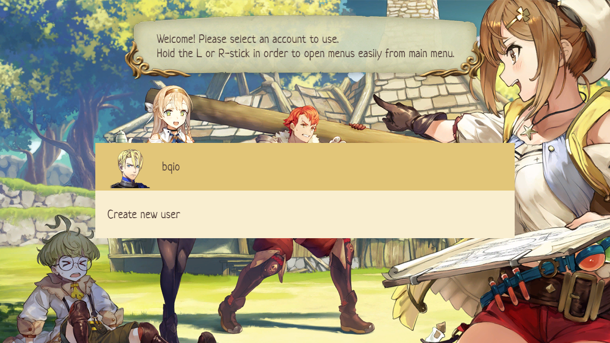
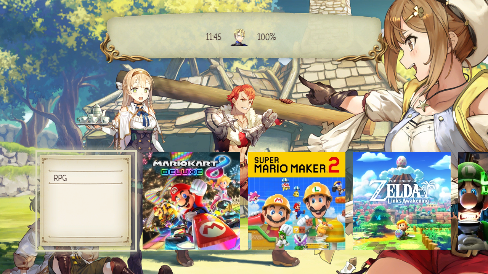
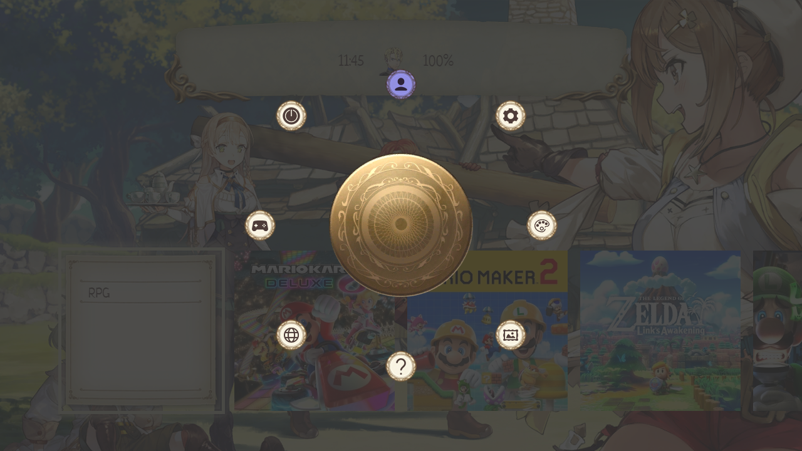
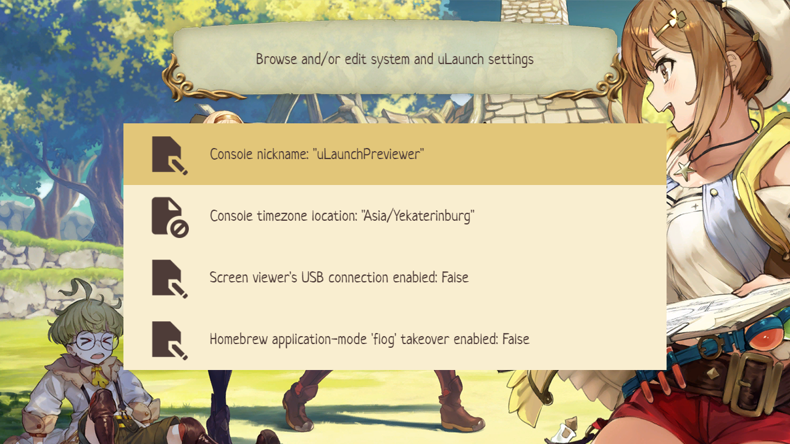
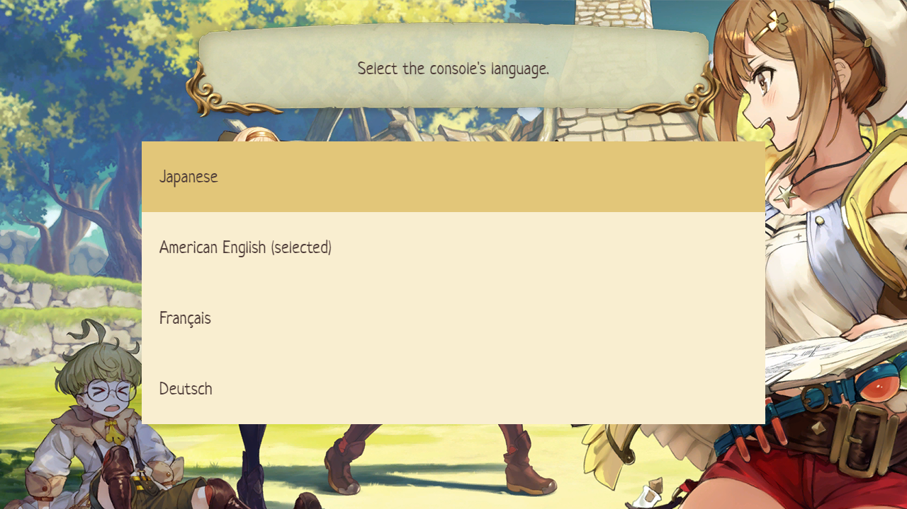
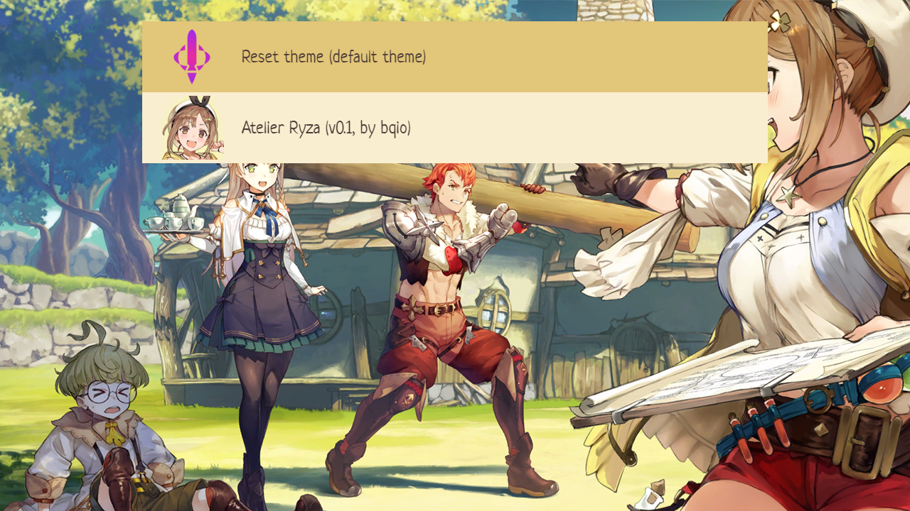

  

<h1 align="center">Atelier Ryza [uLaunch]</h1>

  

# Thanks
* icons by <a target="_blank" href="https://icons8.com">Icons8</a>
* created using [uLaunch Previewer](https://github.com/IcosaSwitch/uLaunch-Previewer)

# Screenshots

## Startup menu

## Main menu

## Quick menu

## Settings menu

## Languages menu

## Themes menu

